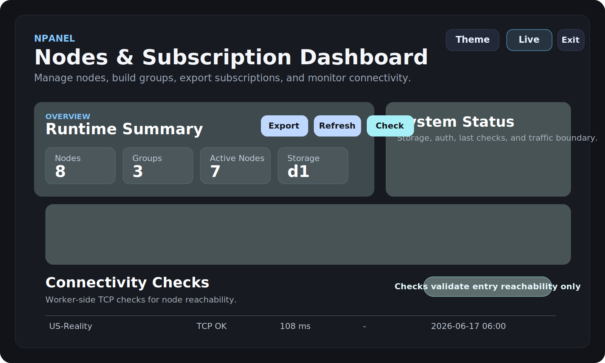

# NPanel

Cloudflare Workers based node and subscription control panel.

基于 Cloudflare Workers 的节点与订阅控制面板。



## Overview | 项目说明

NPanel is a lightweight admin panel for managing proxy nodes, grouping them into subscriptions, and exporting client-friendly links for `v2rayN` and Clash-compatible clients.

NPanel 用来集中管理节点、分组和订阅分发，并提供适合 `v2rayN` 与 Clash 类客户端使用的订阅输出。

### Features | 功能

- Admin login with cookie session
- Node CRUD and group CRUD
- v2rayN subscription export
- Clash subscription export and YAML download
- TCP reachability checks from the Worker side
- D1 persistent storage
- Local mock fallback for UI development
- Theme and brand customization

- 管理员登录与会话控制
- 节点与分组的增删改查
- v2rayN 订阅导出
- Clash 订阅导出与 YAML 下载
- Worker 侧 TCP 可达性检测
- D1 持久化存储
- 本地 mock 存储回退
- 主题与品牌名自定义

## Screenshots | 界面展示

- Dashboard mockup: [`docs/assets/dashboard-demo.svg`](docs/assets/dashboard-demo.svg)

## Repository Structure | 仓库结构

- [`README.md`](README.md): overview and quick start
- [`DEPLOY_GITHUB_CLOUDFLARE.md`](DEPLOY_GITHUB_CLOUDFLARE.md): deployment guide
- [`MAINTENANCE.md`](MAINTENANCE.md): routine operations and maintenance
- [`FAQ.md`](FAQ.md): common issues and answers
- [`PUSH_CHECKLIST.md`](PUSH_CHECKLIST.md): release checklist before pushing
- [`database/0001_init.sql`](database/0001_init.sql): D1 schema
- [`database/0002_seed_demo.sql`](database/0002_seed_demo.sql): demo seed using example addresses
- [`scripts/run-remote-demo-seed.mjs`](scripts/run-remote-demo-seed.mjs): guarded remote demo seed runner

## Quick Start | 快速开始

### Local UI preview | 本地预览

```bash
npm install
npm run dev
```

Open:

```text
http://127.0.0.1:8787
```

### Local D1 mode | 本地 D1 模式

```bash
npm run db:local:init
npm run db:local:seed
npm run dev:d1
```

Open:

```text
http://127.0.0.1:8788
```

If `ADMIN_PASSWORD` is not set locally, the development fallback password is:

```text
change-me
```

Create `.dev.vars` from `.dev.vars.example` when needed.

## Production Path | 生产部署顺序

1. Create a D1 database
2. Replace the placeholder `database_id` in `wrangler.jsonc`
3. Run remote schema init
4. Set `ADMIN_PASSWORD`
5. Set `SESSION_SECRET`
6. Deploy the Worker

1. 创建 D1 数据库
2. 将 `wrangler.jsonc` 中的占位 `database_id` 替换为自己的值
3. 初始化远程数据库结构
4. 配置 `ADMIN_PASSWORD`
5. 配置 `SESSION_SECRET`
6. 部署 Worker

## Security Notes | 安全说明

- This repository contains example-only demo data.
- Replace every placeholder before production deployment.
- Do not commit real secrets, real node keys, or real server endpoints.
- Cloudflare should only front the panel UI, admin API, and subscription delivery.
- Real proxy traffic should go directly to your VPS or relay entry, not through Cloudflare orange-cloud proxying.

- 仓库内仅保留示例数据。
- 上线前必须替换全部占位配置。
- 不要提交真实密钥、真实节点参数或真实服务器地址。
- Cloudflare 只建议承载面板网页、管理 API 与订阅分发。
- 实际代理流量应直接连接 VPS 或中转入口，不应走 Cloudflare 橙云代理。

## Documentation | 文档入口

- Deployment: [`DEPLOY_GITHUB_CLOUDFLARE.md`](DEPLOY_GITHUB_CLOUDFLARE.md)
- Maintenance: [`MAINTENANCE.md`](MAINTENANCE.md)
- FAQ: [`FAQ.md`](FAQ.md)
- Release checklist: [`PUSH_CHECKLIST.md`](PUSH_CHECKLIST.md)

## License | 许可证

Add the license that fits your release plan before making the repository public.

公开仓库前，请按自己的开源计划补充合适的许可证。
