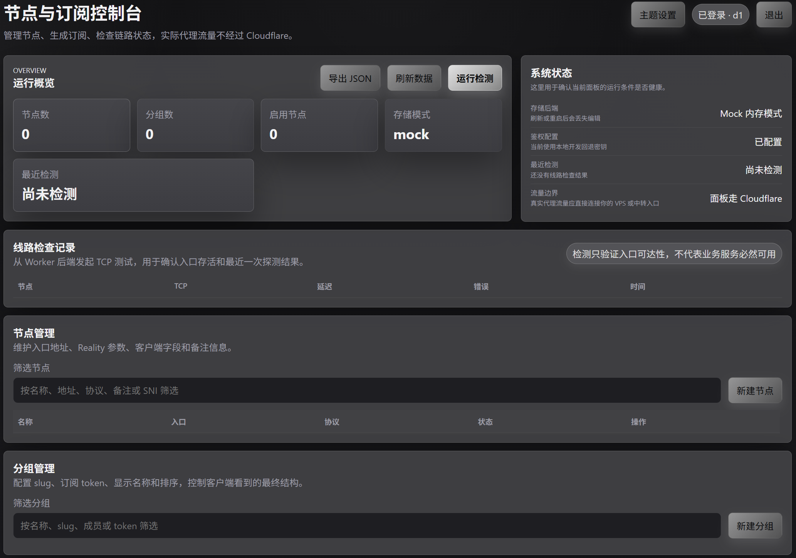
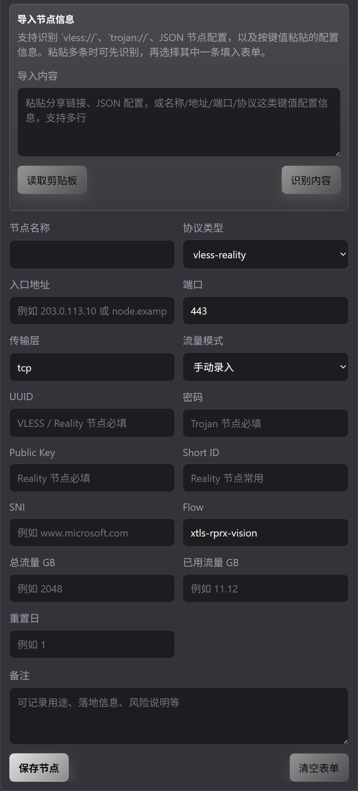
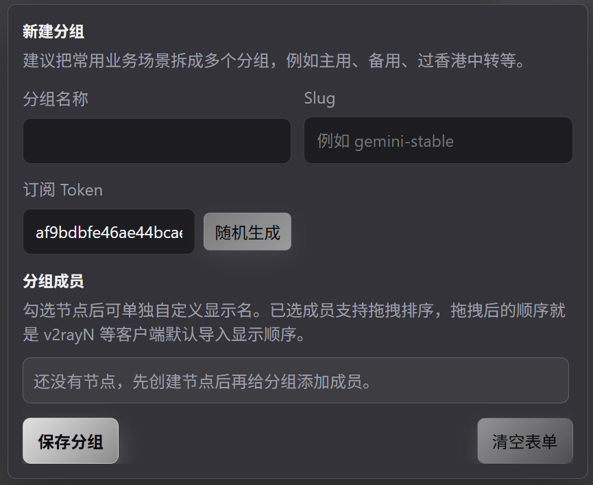

# NPanel

基于 Cloudflare Workers 的节点与订阅控制面板。



## 项目说明

NPanel 用来集中管理节点、分组和订阅分发，并提供适合 `v2rayN` 与 Clash 类客户端使用的订阅输出。

### 主要功能

- 管理员登录与会话控制
- 节点与分组的增删改查
- `v2rayN` 订阅导出
- Clash 订阅导出与 YAML 下载
- Worker 侧 TCP 可达性检测
- D1 持久化存储
- 本地 mock 存储回退
- 主题与品牌名自定义

## 界面展示

### 1. 总览面板

展示运行概览、存储模式和线路检测区域，适合快速查看当前面板状态。


### 2. 节点导入与编辑

支持粘贴分享链接、JSON 片段，以及完整的手动节点录入表单。



### 3. 分组创建

提供分组名称、`slug`、订阅 `token` 和成员顺序控制，用于生成最终订阅结构。



## 仓库结构

- [`README.md`](README.md)：项目总览与快速开始
- [`DEPLOY_GITHUB_CLOUDFLARE.md`](DEPLOY_GITHUB_CLOUDFLARE.md)：部署流程
- [`CHANGELOG.md`](CHANGELOG.md)：版本与更新记录
- [`MAINTENANCE.md`](MAINTENANCE.md)：后期维护
- [`FAQ.md`](FAQ.md)：常见问题
- [`PUSH_CHECKLIST.md`](PUSH_CHECKLIST.md)：发布前检查清单
- [`database/0001_init.sql`](database/0001_init.sql)：D1 数据库结构
- [`database/0002_seed_demo.sql`](database/0002_seed_demo.sql)：演示数据
- [`scripts/run-remote-demo-seed.mjs`](scripts/run-remote-demo-seed.mjs)：远程演示数据写入脚本

## 快速开始

### 本地预览

```bash
npm install
npm run dev
```

打开：

```text
http://127.0.0.1:8787
```

### 本地 D1 模式

```bash
npm run db:local:init
npm run db:local:seed
npm run dev:d1
```

打开：

```text
http://127.0.0.1:8788
```

如果本地没有配置 `ADMIN_PASSWORD`，开发环境默认密码为：

```text
change-me
```

需要自定义本地密钥时，可从 `.dev.vars.example` 复制生成 `.dev.vars`。

## 生产部署顺序

1. 创建 D1 数据库
2. 将 `wrangler.jsonc` 中的占位 `database_id` 替换为自己的值
3. 初始化远程数据库结构
4. 配置 `ADMIN_PASSWORD`
5. 配置 `SESSION_SECRET`
6. 部署 Worker

## 安全说明

- 仓库内仅保留示例数据
- 上线前必须替换全部占位配置
- 不要提交真实密钥、真实节点参数或真实服务器地址
- Cloudflare 只建议承载面板网页、管理 API 与订阅分发
- 实际代理流量应直接连接 VPS 或中转入口，不应走 Cloudflare 橙云代理

## 文档入口

- 部署流程：[DEPLOY_GITHUB_CLOUDFLARE.md](DEPLOY_GITHUB_CLOUDFLARE.md)
- 更新日志：[CHANGELOG.md](CHANGELOG.md)
- 常用备忘：[QUICK_WORKFLOW.md](QUICK_WORKFLOW.md)
- 后期维护：[MAINTENANCE.md](MAINTENANCE.md)
- 常见问题：[FAQ.md](FAQ.md)
- 发布前检查：[PUSH_CHECKLIST.md](PUSH_CHECKLIST.md)

## 许可证

本项目当前使用 `MIT License`，详见 [LICENSE](LICENSE)。
